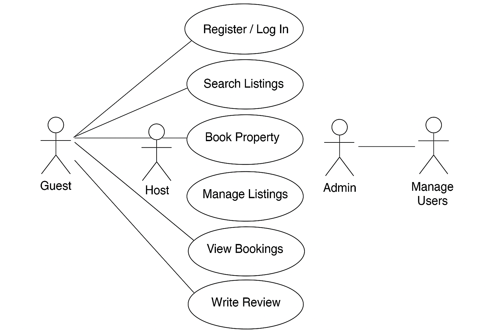

# Requirement Analysis in Software Development

This repository provides an overview and resources related to the process of Requirement Analysis in Software Development. It covers key concepts, best practices, and documentation templates to help understand and implement effective requirement gathering, analysis, and validation.

## What is Requirement Analysis?

Requirement Analysis is a crucial phase in the Software Development Lifecycle (SDLC) where the needs and expectations of stakeholders are gathered, analyzed, and documented. This process involves identifying the functional and non-functional requirements that the software system must fulfill. The primary goal is to ensure a clear understanding between stakeholders and the development team to build a system that meets business objectives and user needs.

Importance of Requirement Analysis includes:

- Defining clear and unambiguous requirements to guide development.
- Preventing scope creep by setting boundaries for what the system will deliver.
- Reducing risks and costs associated with changes later in the development process.
- Enhancing communication among stakeholders, developers, testers, and project managers.
- Providing a foundation for designing, coding, testing, and maintaining the software.

Effective requirement analysis helps deliver a successful software product that satisfies both user expectations and business goals.

## Why is Requirement Analysis Important?

Requirement Analysis is a vital step in the Software Development Lifecycle (SDLC) for several important reasons:

1. **Ensures Clear Understanding:** It helps bridge the communication gap between stakeholders and developers by clearly defining what the system should do. This reduces misunderstandings and incorrect assumptions.

2. **Prevents Scope Creep:** By documenting and agreeing on requirements early, it sets clear boundaries for the project, minimizing unexpected changes and additional features that can delay delivery and increase costs.

3. **Reduces Development Risks and Costs:** Early identification of potential issues and conflicting requirements allows for timely resolution, which lowers the risk of costly rework during later stages like coding and testing.

These reasons contribute to building a software product that meets user needs, stays within budget, and is delivered on time.

## Key Activities in Requirement Analysis

Requirement Analysis involves several critical activities that ensure a successful outcome:

- **Requirement Gathering:** Collecting raw information from stakeholders through interviews, surveys, observation, and existing documentation to understand what the system should achieve.

- **Requirement Elicitation:** Engaging with stakeholders to clarify, refine, and elaborate on their needs using techniques like brainstorming, workshops, and prototyping.

- **Requirement Documentation:** Organizing and recording requirements clearly and precisely in formats such as requirement specifications, user stories, or use case diagrams.

- **Requirement Analysis and Modeling:** Breaking down and structuring requirements to identify conflicts, dependencies, and priorities, often using models like data flow diagrams or UML.

- **Requirement Validation:** Reviewing the documented requirements with stakeholders to ensure completeness, correctness, and feasibility before development begins.

## Types of Requirements

### Functional Requirements

Functional requirements describe the specific behaviors or functions the system must perform. They define what the system should do to satisfy user needs.

**Examples for a Booking Management System:**
- Users must be able to register and log in securely.
- The system should allow users to search for available properties by location and date.
- Users must be able to book a property and receive a confirmation email.
- Admins should be able to add, update, or remove property listings.

### Non-functional Requirements

Non-functional requirements specify how the system performs certain functions, focusing on qualities and constraints rather than behaviors.

**Examples for a Booking Management System:**
- The system should load the property search results within 2 seconds.
- User data must be encrypted to ensure privacy and security.
- The system should be available 99.9% of the time.
- The platform should support up to 10,000 concurrent users without degradation in performance.

## Use Case Diagrams

### What is a Use Case Diagram?

A **Use Case Diagram** is a visual representation used in requirement analysis to illustrate the functional interactions between users (actors) and a system. It helps stakeholders understand the high-level behavior of the system from the user's perspective.

### Benefits of Use Case Diagrams

- 🧩 Clearly defines system boundaries and user roles
- 🗣 Facilitates communication between stakeholders, developers, and designers
- 🧪 Helps identify functional requirements early in the development process
- 🔄 Encourages iteration and feedback

### Use Case Diagram: ALX Booking System

The diagram below represents a simplified use case model of the ALX Booking System. It includes the primary actors and the main interactions they have with the system.

